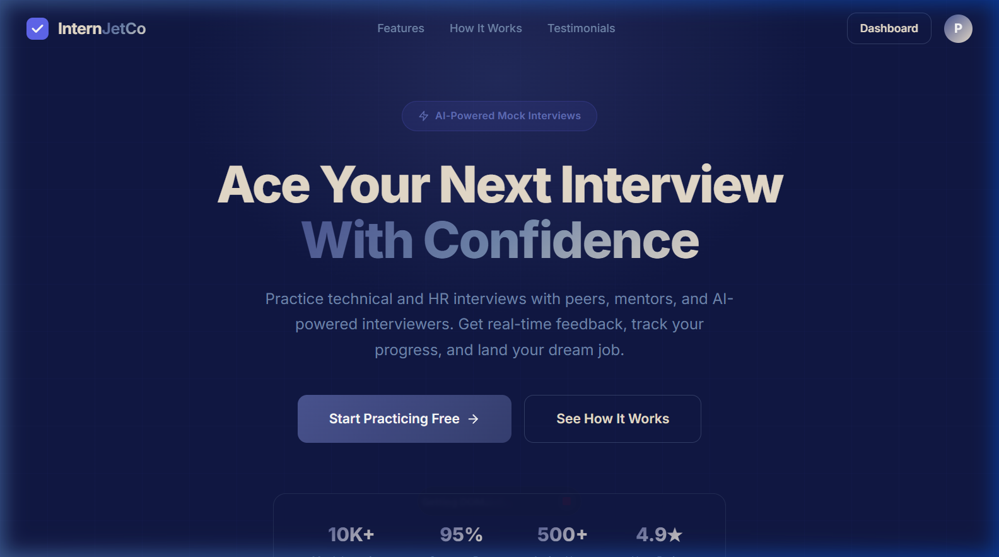
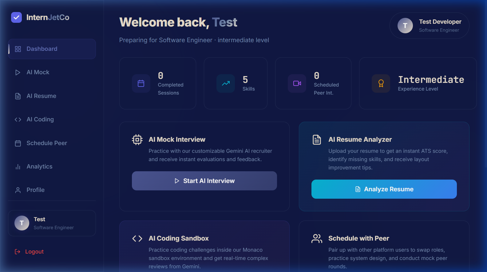
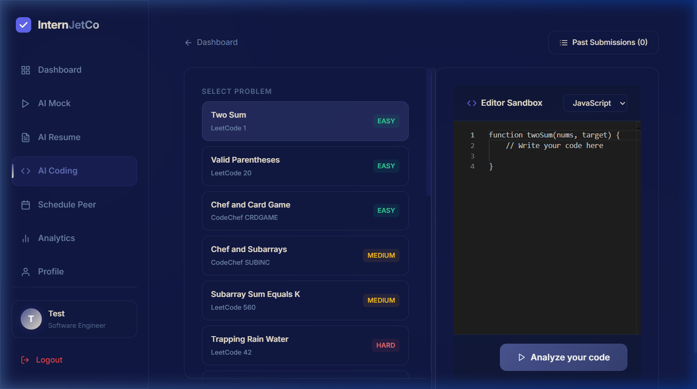
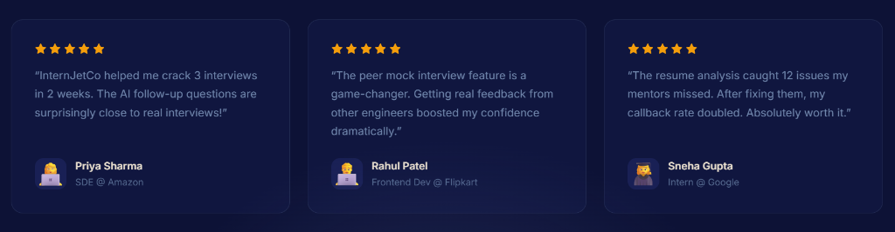
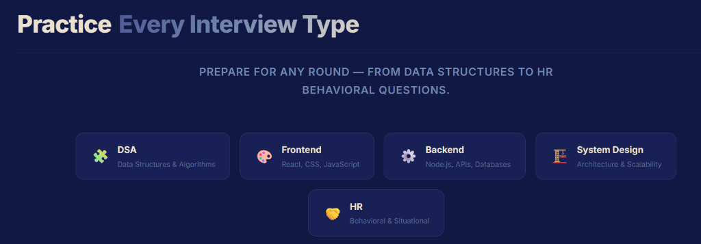
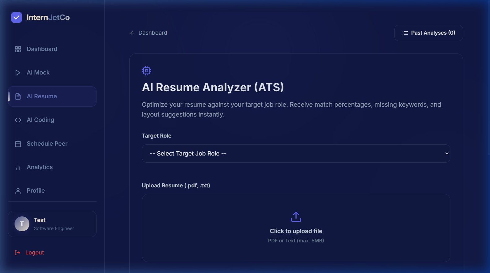
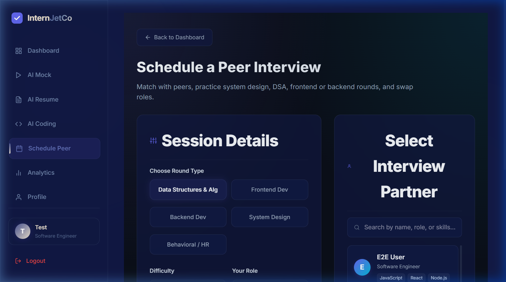
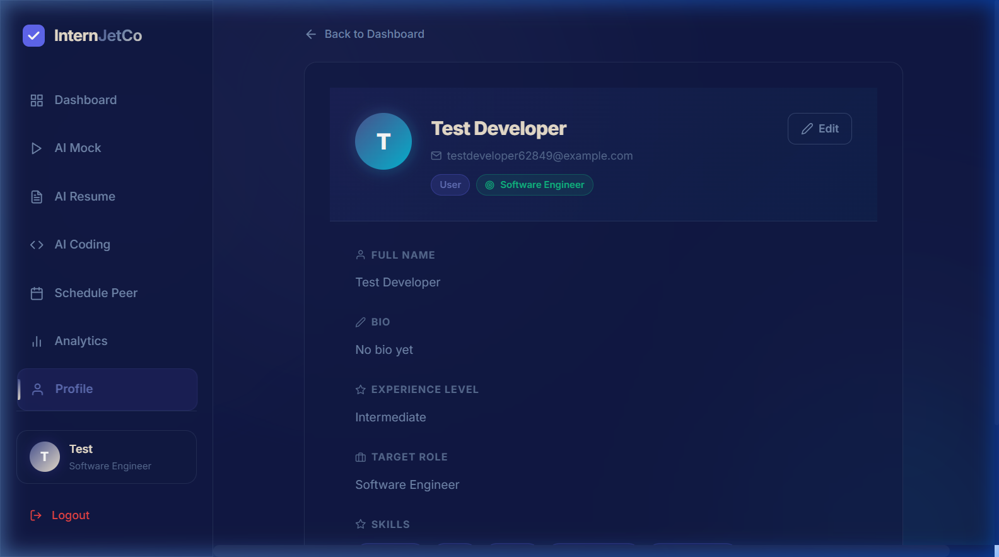

# 🚀 InternJetCo — Next-Gen AI & Peer Mock Interview Platform

InternJetCo is a premium, feature-rich web application designed to prepare developers for technical, behavioral, and system design interviews. It combines real-time AI feedback with collaborative peer-to-peer interview simulation, offering a state-of-the-art prep ecosystem.

---

## 🎨 Global UI & Styling System
The platform features a modern, customized dark theme crafted with standard-compliant layouts and custom styling (clean of default AI boilerplate emojis).
*   **Primary Background**: Deep Dark Navy (`#111844`)
*   **Secondary Background**: Dark Indigo (`#0d1236`)
*   **Card Background**: Steel Slate (`#192055`)
*   **Primary Text**: Warm Sand/Cream (`#eae0cf`)
*   **Accent Color**: Steel Indigo / Lavender (`#4b5694`)
*   **Icons**: Replaced all emojis with premium React Icons (`FiCpu`, `FiCode`, `FiUsers`, `FiTrendingUp`, `FiTarget`, etc.)

---

## 🌟 Key Features

### 💻 1. Interactive AI Coding Sandbox
*   **Monaco Code Editor**: Code in a fully featured editor with syntax highlighting and formatting support.
*   **Interactive Split-Pane**: A custom resizable divider separating the problem details from the coding workspace. Users can drag the divider left or right.
*   **Code Review & Graphs**: Submitting code runs an intelligent review using the Gemini Pro API. It renders real-time performance metrics via interactive Recharts (Gauge, Radar, and Line charts).
*   **Learning Recommendations**: Generates personalized improvement advice, embedded YouTube tutorial videos, and practice links on LeetCode/GeeksforGeeks.
*   **Shuffled Difficulty Progression**: Challenges pull from easy, medium, and hard ranges from platform practice catalogs.

### 🎙️ 2. AI-Powered Mock Interviews
*   **Realistic Audio Sessions**: Converse with an AI interviewer via speech-to-text integration.
*   **Role-Specific Questions**: Technical, Behavioral, and System Design tracks tailored to your target role and experience.
*   **Advanced Scorecards**: Delivers granular analysis of response accuracy, confidence, vocabulary, and communication clarity.

### 👥 3. Collaborative Peer Interviews
*   **Live Video & Audio Rooms**: Powered by ZegoCloud for low-latency media connections.
*   **Synced Real-Time Chat**: Immediate message forwarding with active typing indicators.
*   **Collaborative Notepad**: A synchronized scratchpad utilizing WebSockets for real-time document sharing.
*   **Synced Interview Timer**: An interviewer-controlled synced timer to keep track of session length.

### 📄 4. AI Resume Analyzer
*   **Drag & Drop Upload**: Upload PDF resumes directly.
*   **Gemini parser**: Analyzes text parsing, identifies skill matches, formatting advice, and recommends improvements for specific roles.

---

## 🛠️ Tech Stack

### Frontend
*   **Core**: React (Vite environment), HTML5, CSS3 Custom Properties
*   **State Management**: Redux Toolkit & React Redux
*   **Media**: `@zegocloud/zego-uikit-prebuilt` & WebRTC
*   **Charts & Visuals**: Recharts, Framer Motion
*   **Icons**: React Icons (lucide-react / feather icons)
*   **Editor**: `@monaco-editor/react`

### Backend
*   **Runtime**: Node.js & Express
*   **Database**: MongoDB (via Mongoose ODM)
*   **Real-time Protocol**: Socket.io (WebSockets)
*   **AI Engine**: Gemini Pro API (`@google/generative-ai`)

---

## 📁 Directory Structure

```text
InternJetCo/
├── client/                 # React frontend
│   ├── src/
│   │   ├── assets/         # Images & static assets
│   │   ├── components/     # Reusable layout/auth components
│   │   ├── layouts/        # Application grid systems
│   │   ├── pages/          # Core pages (Dashboard, AICoding, InterviewRoom, etc.)
│   │   ├── redux/          # Redux Toolkit global store & slices
│   │   └── services/       # API services (Axios configuration)
│   ├── package.json
│   └── vite.config.js
│
├── server/                 # Node/Express backend
│   ├── config/             # DB connection config
│   ├── controllers/        # REST controllers (auth, peerInterview, etc.)
│   ├── middleware/         # Auth verify & Error handlers
│   ├── models/             # Mongoose schemas (User, Interview, Feedback, etc.)
│   ├── routes/             # REST endpoints route declarations
│   ├── services/           # Gemini API integrations
│   ├── sockets/            # Socket.io event triggers (notepad sync, timers, chat)
│   ├── package.json
│   └── server.js
│
└── screenshots/            # UI screenshots & media files
```

---

## 🚀 Getting Started

### Prerequisites
*   [Node.js](https://nodejs.org/) (v18 or higher recommended)
*   [MongoDB](https://www.mongodb.com/) (Local Community Server or Atlas URI)
*   Gemini Pro API Key (from Google AI Studio)
*   ZegoCloud App ID and Server Secret (from ZegoCloud Console)

---

### Setup Instructions

#### 1. Setup the Server
Navigate to the server directory:
```bash
cd server
```

Install the backend dependencies:
```bash
npm install
```

Create a `.env` file in the `server/` root folder:
```env
PORT=5000
NODE_ENV=development
CLIENT_URL=http://localhost:5173
MONGODB_URI=your_mongodb_connection_uri
JWT_SECRET=your_jwt_secret_key
JWT_EXPIRE=7d

# ZEGOCLOUD Video Configuration
ZEGOCLOUD_APP_ID=Zegocloud_app_id
ZEGOCLOUD_SERVER_SECRET=your_Zegocloud_server_secret_key

# Gemini AI Key
GEMINI_API_KEY=your_gemini_api_key
```

Run the backend server in development mode:
```bash
npm run dev
```

---

#### 2. Setup the Client
Open a new terminal window and navigate to the client directory:
```bash
cd client
```

Install the frontend dependencies:
```bash
npm install
```

Start the Vite development server:
```bash
npm run dev
```

The application will be running locally at: `http://localhost:5173`

---

## 📸 Screenshots Gallery

Here are the visual walkthroughs of the key pages in InternJetCo:

### 🏠 Landing Page & Dashboard Workspace
*A premium dark landing page with custom icons, leading to a centralized dashboard displaying target role metrics, progress gauges, and scheduled peer rounds.*



### 💻 Drag-Resizable Coding Sandbox
*The resizable programming environment featuring the Monaco Editor, detailed problem constraints, and custom analytics reporting.*


### 👥 Peer Video Mock Rooms
*Low-latency live mock room displaying synchronized notepad document controls, dynamic timer sync, and WebSockets-driven peer chat.*



### 📄 AI Resume Parsing Report
*The resume analyzer reporting parsing scores, formatting recommendations, and keyword matching.*


### 📅 Interview Scheduling & Profile
*Select peer partners, schedule interview sessions, and configure profile parameters.*



---

